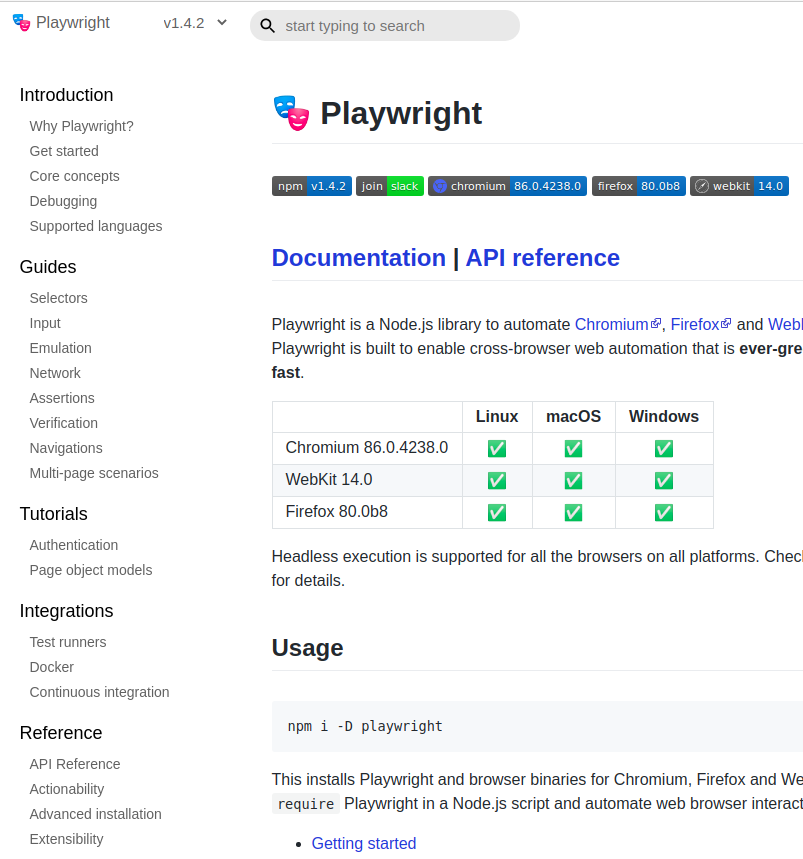
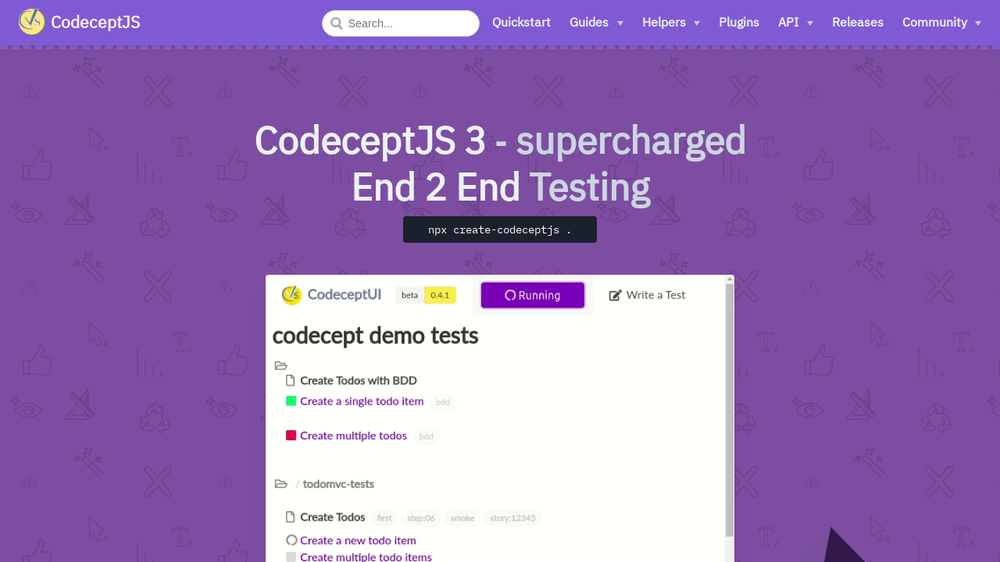
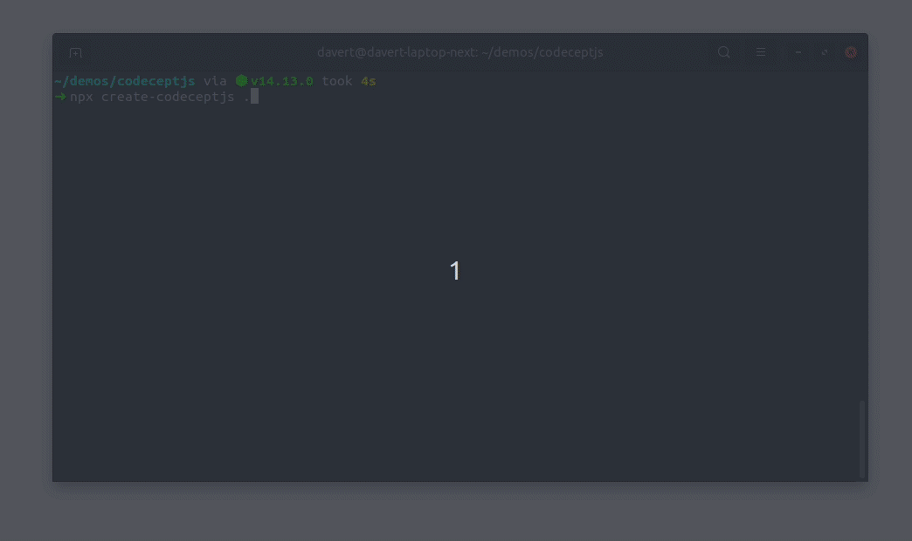
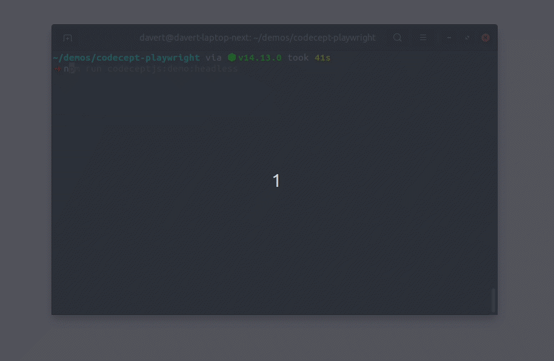
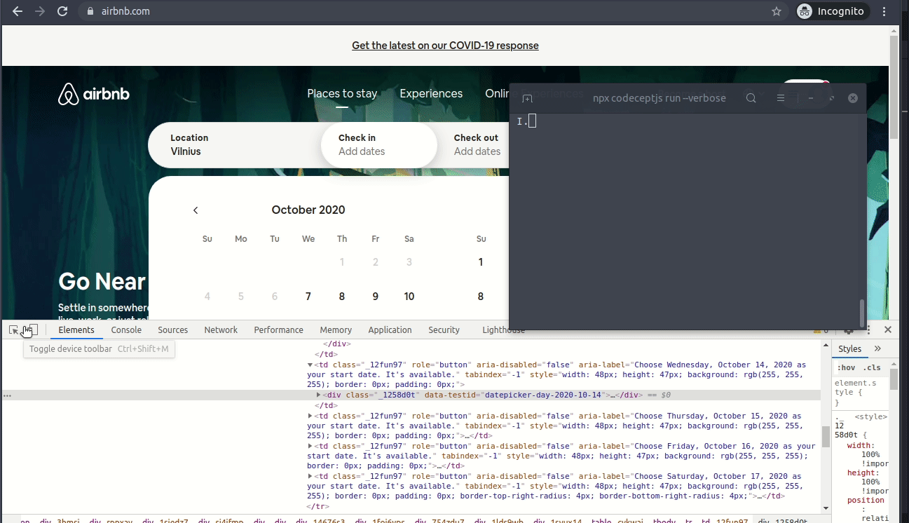
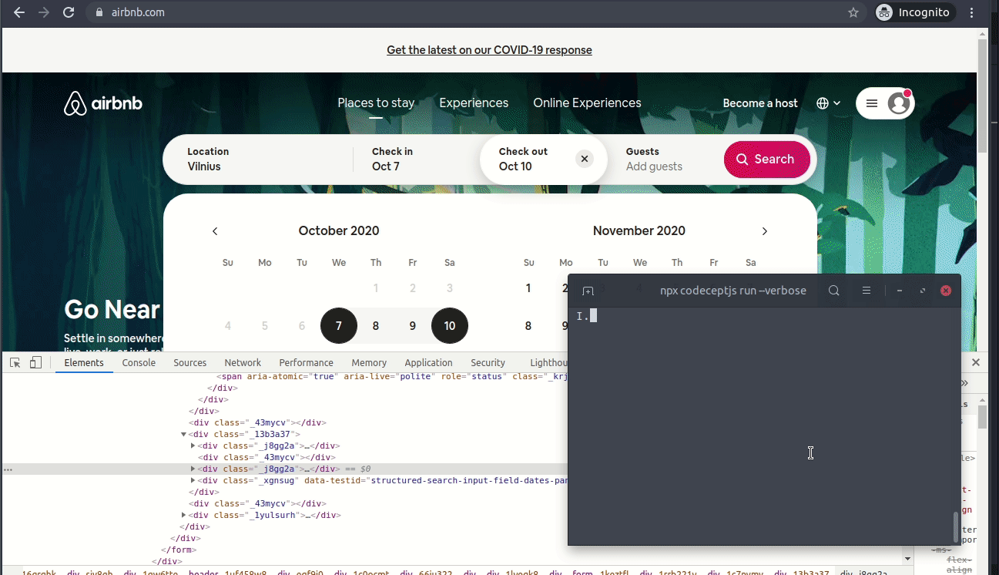
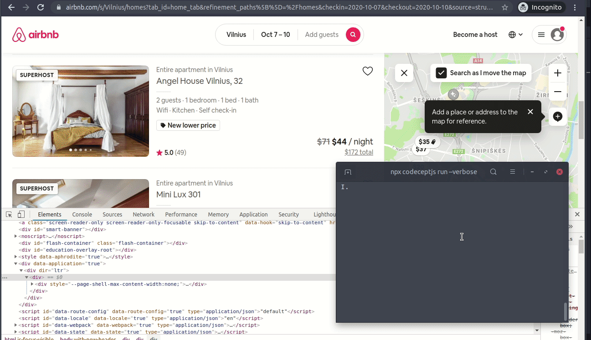
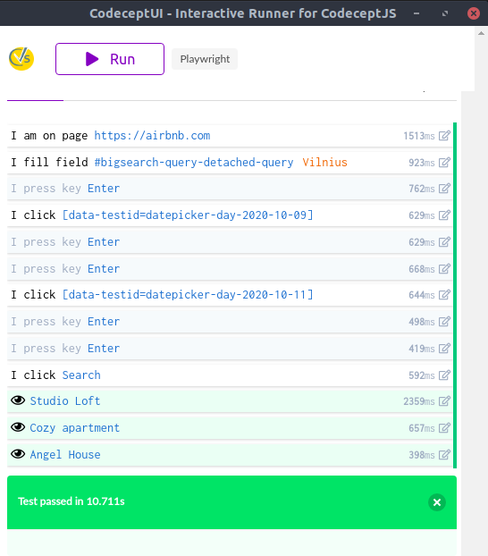

# Play it Right!

Extraordinary End 2 End Testing with

### Playwright & CodeceptJS 3


--

by Michael Bodnarchuk @davert

---

## About Me


* Web Developer from Kyiv, Ukraine
* Creator of open-source testing frameworks:
  * [CodeceptJS](https://codcept.io)
  * [Codeception](https://codeception.com) (PHP)
* Building next-gen test management cms Testomat.io

---

## End 2 End Testing

* Browser Testing
  * How to set up browsers?
  * Do I need Selenium?
  * How to speed up browsers?
* Testing Web Applications
  * Interface is flaky
  * No reliable application state
  * Which locators to use

---



## What is [Playwright](https://github.com/microsoft/playwright)

* Selenium Alternative
* A new tool by Microsoft from creators of Puppeteer
* Works in all 3 modern browser engines
  * Chromium
  * Firefox
  * WebKit (Safari)
* Supports Headless
* Works with NodeJS / Python

---

<!-- class: lead -->


# Playwright Features

* API control of DevTools
* Bi-directional control
* Integrated in browsers (via patches)
* Video recording built-in
* Network modifications
* Device emulation

---

## API Example


```js
  const browser = await firefox.launch();
  const context = await browser.newContext();
  const page = await context.newPage();
  await page.goto('https://maps.google.com');
  await page.click('text="Your location"');
  await page.waitForRequest(/.*preview\/pwa/);
  await page.screenshot({ path: 'colosseum-iphone.png' });
  await browser.close();
```

---

## API Overview

* `Browser` - controls browser behavior
* `Context` - controls current browser window
* `Page` - controls current browser tab
* `Element` - controls currently selected element
* `Frame` - controls iframe

---

## Playwright Limitations

* Playwright is not a testing framework
  * no built-in assertions
  * no auto-retries
  * no implicit waits
* Low-level NodeJS API
  * `await` everywhere
  * callbacks from browser

---



## Powering Up Playwright with CodeceptJS

codecept.io

---


## CodeceptJS

* BDD-style testing framework
* Focused on browser testing
* Same API for all browser engines
  * Playwright
  * WebDriver
  * Protractor
  * Puppeteer
  * TestCafe

---

## Example

```js

      I.amOnPage('https://playwright.dev');
      I.click('Get started');
      I.waitForElement('#content');
      I.see('Getting Started', 'h1');
      I.fillField({css: 'searchview input'}, 'Network');
      I.pressKey('Enter');
      I.see('Network','h1');

```

---



### Installing CodeceptJS

```
npx create-codeceptjs .
```

*it automatically installs Playwright for you*

---



### Creating First Test

```
npx codeceptjs init
```

* set browser engine
* set base url
* set paths

---

## First Test

```js
Feature('Book');

Scenario('book apartment', ({ I }) => {
  I.amOnPage('https://airbnb.com');
  pause();
}
```
Let's see what `pause()` is 👉

---


---



---



---



---

## Complete Test in CodeceptJS

```js
Feature('Book');

Scenario('book apartment', ({ I }) => {
  I.amOnPage('https://airbnb.com');
  I.fillField('#bigsearch-query-detached-query', 'Vilnius')
  I.pressKey('Enter');
  I.click('[data-testid=datepicker-day-2020-10-09]')
  I.pressKey('Enter')
  I.click('[data-testid=datepicker-day-2020-10-12]')
  I.pressKey('Enter')
  I.pressKey('Enter')
  I.click('Search')
  I.see('Studio Loft')
  I.see('Cozy apartment')
  I.see('Angel House')
});
```

---


## CodeceptUI



```
npm run codeceptjs:ui
```

Interactive test runner

* pause() support
* single browser session used
* headless/window mode

---

## Features of CodeceptJS

* Parallel execution by workers
* Auto-retries for failed steps
* PageObjects
* Beautiful Allure reports
* Cucumber BDD support

... 

---

## Use Playwright API

```js
I.amOnPage('https://airbnb.com');
I.usePlaywrightTo('enable dark mode', async ({ page }) => {
  // Change color scheme for the page
  await page.emulateMedia({ colorScheme: 'dark' });
})

```

---

## Locator Builder

Generate complex XPaths with ease

```ts
I.click(
  locate('//table')
    .find('a')
    .withText('Edit')
    .as('edit button')
);    
```

---

## Conclusion

* CodeceptJS is a testing framework focused on end-2-end tests
* CodeceptJS delegates execution to Playwright, WebDriver, etc
* CodeceptJS is free & open-source since 2015
* Tastes the best with Playwright

---

## Questions 🤔

Codecept.io

Code: [github.com/davertMik/demo-codecept3-airbnb](https://github.com/DavertMik/demo-codecept3-airbnb)

Follow me: 🐦 [twitter.com/@davert](https://twitter.com/davert)

Next-gen Test Management ⏩ testomat.io